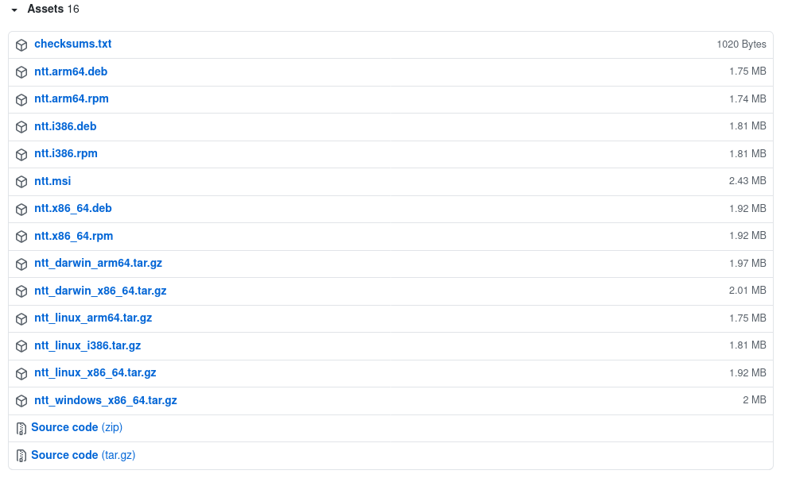

 
<b>
<a href="https://nokia.github.io/ntt/">Documentation</a>&nbsp;&nbsp;|&nbsp;&nbsp;
<a href="#install">Installation</a>&nbsp;&nbsp;|&nbsp;&nbsp;
<a href="#contact-us">Contact</a>&nbsp;&nbsp;|&nbsp;&nbsp;
<a href="https://github.com/nokia/ntt/blob/master/CONTRIBUTING.md">Contribute</a>
</b>
 
 
 

**ntt** is a free and open toolset for language agnostic testing with
[TTCN-3](https://nokia.github.io/ntt#whats-ttcn-3). It provides IDE support,
code generators and much more. Have a look at the
[documentation](https://nokia.github.io/ntt) page for further details.

**ntt** is written in native Go and has full support for
[TTCN-3 Core Language Specification v4.11.1](https://www.etsi.org/deliver/etsi_es/201800_201899/20187301/04.11.01_60/es_20187301v041101p.pdf) and various extensions. Without cutting corners, it is one of the
fastest TTCN-3 tools available

# Install

The [Visual Studio Code
Extension](https://marketplace.visualstudio.com/items?itemName=Nokia.ttcn3) and
the [vim-lsp-settings](https://github.com/mattn/vim-lsp-settings) should install
and update ntt automatically. But it's also possible to install ntt manually.

You can choose between installing the pre-built binaries or compiling NTT from
source. Using the binaries is usually easier. Compiling from source means you
have more control.

Please note, ntt helper tools, like the `FindNTT.cmake` or `ntt-mcov` are not
included in pre-built binary packages, yet. Consider building from source.

## Install pre-built binaries

We provide pre-built binaries for Mac, Windows and Linux and for various architectures:

**Windows Installer**

We provide a [Microsoft Windows
Installer](https://github.com/nokia/ntt/releases/latest/download/ntt.msi). The
advantage of this installer is it configures your PATH settings, so ntt is
reachable from shells. This allows you to start hacking without any ado.

We have not signed the installer, though.

**Debian Packages**

Download the .deb package from the
[releases](https://github.com/nokia/ntt/releases) page and install with `dpkg -i`.

**RPM Packages**

Download the .rpm package from the
[releases](https://github.com/nokia/ntt/releases) page and install with package
manager of your choice. You can also install directly from the internet:

    sudo dnf install https://github.com/nokia/ntt/releases/latest/download/ntt.x86_64.rpm

## Go Get Method

If you have Go installed, you may easily install our commands by using the go-get method:

     go get github.com/nokia/ntt/cmd/...

However note, this will install latest ntt from master branch and thus the
version might not be correct:

    $ ntt version
    ntt dev, commit none, built at unknown

## Compiling from Source

**ntt** requires a [Go compiler](https://golang.org/dl/) >= 1.13, git and make to
build. To build and install simply call:

	make
	sudo make install

You may control installation by specifying PREFIX and DESTDIR variables. For example:

	make PREFIX=/
	make install DESTDIR=$HOME/.local

# Contact us

If you have questions, you are welcome to contact us at
[ntt@groups.io](mailto:ntt@groups.io).

You want to contribute? That's great! Kindly read our [contribution
guide](https://github.com/nokia/ntt/blob/master/CONTRIBUTING.md) for more
details.

# Project Status

**ntt** is used by Nokia 4G and 5G in production. By developers and also by our
build automation environment, running millions of TTCN-3 tests per day.  
But **ntt** is still in development and not all features have the same good
test coverage. We recommend verifying ntt functionality before using it in your
automation environment.

## License

This project is licensed under the BSD-3-Clause license - see the [LICENSE](https://github.com/nokia/ntt/blob/master/LICENSE).
