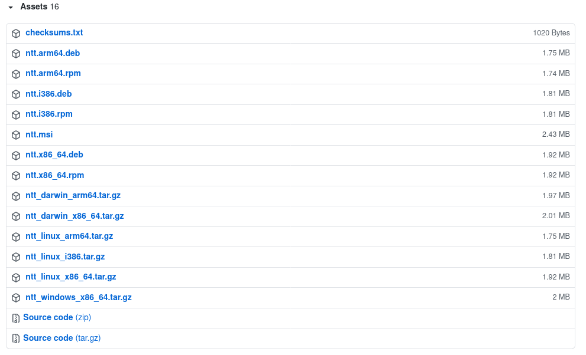

 
<b>
<a href="https://nokia.github.io/ntt/">Documentation</a>&nbsp;&nbsp;|&nbsp;&nbsp;
<a href="#install">Installation</a>&nbsp;&nbsp;|&nbsp;&nbsp;
<a href="#contact-us">Contact</a>&nbsp;&nbsp;|&nbsp;&nbsp;
<a href="https://github.com/nokia/ntt/blob/master/CONTRIBUTING.md">Contribute</a>
</b>
 
 
 

**ntt** is a free and open toolset for language agnostic testing with
[TTCN-3](https://nokia.github.io/ntt#whats-ttcn-3). It provides IDE support,
code generators and much more. Have a look at the
[documentation](https://nokia.github.io/ntt) page for further details.

**ntt** is written in native Go and has full support for
[TTCN-3 Core Language Specification v4.11.1](https://www.etsi.org/deliver/etsi_es/201800_201899/20187301/04.11.01_60/es_20187301v041101p.pdf) and various extensions. Without cutting corners, it is one of the
fastest TTCN-3 tools available.

The `ntt-titan` branch grows **ntt** into a full TTCN-3 toolchain with
an interpret-first execution path, an SSA-style IR with Go and C++
backends, and a real ETSI conformance gate as the always-on
regression check. See [docs/ntt-vs-titan.md](docs/ntt-vs-titan.md) for
the milestone-by-milestone feature matrix and the
[conformance dashboard](docs/conformance/index.html) for the live
pass-rate.

# Install

The [Visual Studio Code
Extension](https://marketplace.visualstudio.com/items?itemName=Nokia.ttcn3) and
the [vim-lsp-settings](https://github.com/mattn/vim-lsp-settings) should install
and update ntt automatically. But it's also possible to install ntt manually.

You can choose between installing the pre-built binaries or compiling NTT from
source. Using the binaries is usually easier. Compiling from source means you
have more control.

Please note, ntt helper tools, like the `FindNTT.cmake` or `ntt-mcov` are not
included in pre-built binary packages, yet. Consider building from source.

## Install pre-built binaries

We provide pre-built binaries for Mac, Windows and Linux and for various architectures:

**Windows Installer**

We provide a [Microsoft Windows
Installer](https://github.com/nokia/ntt/releases/latest/download/ntt.msi). The
advantage of this installer is it configures your PATH settings, so ntt is
reachable from shells. This allows you to start hacking without any ado.

We have not signed the installer, though.

**Debian Packages**

Download the .deb package from the
[releases](https://github.com/nokia/ntt/releases) page and install with `dpkg -i`.

**RPM Packages**

Download the .rpm package from the
[releases](https://github.com/nokia/ntt/releases) page and install with package
manager of your choice. You can also install directly from the internet:

    sudo dnf install https://github.com/nokia/ntt/releases/latest/download/ntt.x86_64.rpm

## Go Get Method

If you have Go installed, you may easily install our commands by using the go-get method:

     go install github.com/nokia/ntt@latest

However note, this will install latest ntt from master branch and thus the
version might not be correct:

    $ ntt version
    ntt dev, commit none, built at unknown

## Compiling from Source

**ntt** requires a [Go compiler](https://golang.org/dl/) >= 1.13, git and make to
build. To build and install simply call:

	make
	sudo make install

You may control installation by specifying PREFIX and DESTDIR variables. For example:

	make PREFIX=/
	make install DESTDIR=$HOME/.local

# Getting started

For a five-minute, end-to-end walkthrough that takes you from "I just
installed ntt" to running a TTCN-3 test in your editor, see
[docs/getting-started.md](docs/getting-started.md).

The short version, for the impatient:

	# 1. type-check a module (no execution, no codegen)
	ntt check Hello.ttcn3

	# 2. interpret-and-run a testcase straight from source
	ntt exec Hello.control

	# 3. compile-and-run via the Go backend (heavier, faster)
	ntt run Hello.control

	# 4. score yourself against the ETSI conformance suite
	ntt conformance testdata/ttcn3-conformance-tests/ATS/

`ntt exec` is the tree-walking interpreter; it needs nothing on the
system besides a working ntt binary - no C++ toolchain, no `make`,
no codegen step. It is the same engine `ntt conformance` uses.

Suites that need to drive a real System Under Test through a Titan-
style C/C++ test port (e.g. `MyClient_PT.cc`) build a dedicated
binary that statically links the port via the cgo bridge. See
[docs/cabi-ports.md](docs/cabi-ports.md) for the full recipe. The
short version is:

	# 1. build ntt with the cgo bridge enabled
	go build -tags cabicgo -o bin/ntt-cabicgo .

	# 2. run any TTCN-3 suite that declares ports registered via
	#    ntt_port_register() in the linked C++ code
	bin/ntt-cabicgo exec --cfg cfg/standalone.cfg

# Subcommands

`ntt` is a single binary with a handful of subcommands. The interesting
ones for the ntt-Titan toolchain are:

| Command            | What it does                                                              |
| ------------------ | ------------------------------------------------------------------------- |
| `ntt check`        | type-check a TTCN-3 module / suite (no execution)                         |
| `ntt compile`      | lower TTCN-3 to the SSA-ish IR, emit Go or C++                            |
| `ntt run`          | compile-and-run via the Go backend                                        |
| `ntt exec`         | interpret-and-run via the tree-walker (no codegen step)                   |
| `ntt explorer`     | emit the test-explorer JSON consumed by the VS Code extension             |
| `ntt mctr` / `hc`  | master / host-controller pair for distributed execution                   |
| `ntt build`        | invoke the Makefile / CMake generator and run the build                   |
| `ntt cfgvalidate`  | static analysis on a `.cfg` file                                          |
| `ntt makefilegen`  | drop-in replacement for Titan's `ttcn3_makefilegen`                       |
| `ntt conformance`  | run the ETSI conformance suite and report pass-rate (CI gate)             |

Run `ntt <subcommand> --help` for the full flag list.

# Conformance

`ntt conformance` runs the
[ETSI TTCN-3 conformance tests](https://forge.etsi.org/rep/ttcn3/ttcn3-conformance-tests)
through the interpreter and compares each file's actual verdict
(`pass` / `fail` / `error` / `parse-error` / ...) against the
`@verdict` annotation in the test header. The pass-rate is the
fraction of annotated files where actual == expected; files annotated
as `inconclusive` are excluded from the denominator.

A negative test (`@verdict pass reject`) is satisfied when the
implementation refuses the code. Eclipse Titan catches most
semantic violations at compile time; an interpret-first implementation
catches them at runtime. We therefore count any non-pass outcome -
`error` (the interpreter aborted) and `fail` (the testcase observed
the bad behaviour and reported it through `setverdict`) - as a
successful reject. `pass` and `inconc` still fail the test because
they mean the violation slipped through.

Current pass-rate: **67.22 %** (3 326 / 4 948 evaluated files;
inconclusive files are excluded from the denominator), tracked in
[`testdata/conformance-baseline.json`](testdata/conformance-baseline.json)
and visualised at
[`docs/conformance/index.html`](docs/conformance/index.html).
CI gates pull requests with `ntt conformance --regress 0.5 --baseline
testdata/conformance-baseline.json`, refusing any push that drops the
pass-rate by more than half a percentage point.

To reproduce locally:

	make
	./ntt conformance --timeout 4s testdata/ttcn3-conformance-tests/ATS/

The interpreter is paired with a growing suite of static semantic
checks (template restrictions, formal/actual parameter rules,
side-effects in restricted contexts, control-part operations, array
dimension validity, interleave restrictions, binary literal formats,
const-literal type compatibility, missing call parentheses, ...).
These rules give `ntt check` the muscle to reject TTCN-3 programs
that Eclipse Titan would only catch at C++ compile time and are also
what powers the recent jumps in the ETSI pass-rate.

# Migration from Eclipse Titan

`ntt migrate from-titan` converts a Titan `.tpd` project into a
`package.yml` that `ntt exec` / `ntt run` understand. The migrator
preserves the source layout, expands the include paths Titan resolves
implicitly, and translates the `.tpd`'s `<RuntimeOptions>` block into
the closest `[EXECUTE]` entries.

	ntt migrate from-titan path/to/project.tpd

After migration, `ntt build` invokes the Makefile / CMake generator so
the resulting project is buildable both ways:

- `ntt run` / `ntt exec` use the Go backend or the interpreter
  directly (no C++ toolchain needed).
- `ntt build && make` (or `cmake --build`) produces a Titan-compatible
  binary you can drop into your existing CI.

The full feature matrix between Titan and ntt is in
[docs/ntt-vs-titan.md](docs/ntt-vs-titan.md).

# Repository layout

| Path                     | What lives here                                                  |
| ------------------------ | ---------------------------------------------------------------- |
| `ttcn3/`                 | parser, AST, type checker, semantic analysis, formatter, linter  |
| `internal/asn1/`         | pure-Go ASN.1:2015 frontend (no external compiler)               |
| `internal/lsp/`          | language-server protocol implementation                          |
| `interpreter/`           | tree-walking interpreter that powers `ntt exec` and `ntt conformance` |
| `runtime/`               | runtime model (values, ports, components, alt, timers, codecs)   |
| `runtime/codec/`         | RAW / TEXT / JSON / OER / BER codecs                             |
| `runtime/{mctr,hc,wire}/`| distributed executor (master, host-controller, line protocol)    |
| `runtime/{explorer,dap}/`| VS Code test-explorer + debugger adapter                         |
| `builtins/`              | TTCN-3 predefined functions (sizeof, lengthof, encvalue, ...)    |
| `ir/`                    | SSA-style intermediate representation                            |
| `backend/golang/`        | Go code generator (used by `ntt run`)                            |
| `backend/cpp/`           | C++ code generator (clean-room, no Titan code)                   |
| `build/`                 | Makefile / CMake generators (`ntt makefilegen`, `cfgvalidate`)   |
| `cmake/`                 | `NTTTitan.cmake` module for downstream consumers                 |
| `project/tpdmigrate/`    | Titan `.tpd` -> `package.yml` migrator                           |
| `testdata/`              | unit-test fixtures + the ETSI conformance suite + baseline       |
| `docs/`                  | user-facing docs (incl. live conformance dashboard)              |

A new feature usually lands in one of `ttcn3/`, `interpreter/`,
`runtime/`, or `backend/` - the `doc.go` in each package explains the
contract that package promises.

# Roadmap

The ntt-Titan vision is staged into nine milestones (M1-M9). Each
milestone is a ship-ready cut with its own test coverage, conformance
gate, and documentation entry.

| Milestone                          | Status   | What ships                                                     |
| ---------------------------------- | -------- | -------------------------------------------------------------- |
| M1 Foundations                     | shipped  | parser, semantic checker, `ntt check`                          |
| M2 Runtime core                    | shipped  | template / component / port / alt / timer                      |
| M3 Codec generators                | shipped  | RAW / TEXT / JSON / OER / BER                                  |
| M4 Single-process executor         | shipped  | `ntt exec`, `.cfg`, reports                                    |
| M5 Distributed executor + ports    | shipped  | `ntt mctr` / `ntt hc`, test-port API                           |
| M6 Build tooling                   | shipped  | `ntt {migrate,makefilegen,cfgvalidate,build}`                  |
| M7 MIR + Go backend                | shipped  | SSA IR, `ntt run`                                              |
| M8 C++ backend + runtime mirror    | shipped  | `backend/cpp`, `runtime/cpp` (clean-room)                      |
| M9 Adoption (IDE + docs)           | shipped  | explorer, DAP, dashboards                                      |

Currently in flight: lifting the interpreter pass-rate toward 80 %
(per-feature breakdown in
[docs/ntt-vs-titan.md](docs/ntt-vs-titan.md)). The conformance
dashboard at [docs/conformance/index.html](docs/conformance/index.html)
records the per-push history.

# Contact us

If you have questions, you are welcome to contact us at
[ntt@groups.io](mailto:ntt@groups.io).

You want to contribute? That's great! Kindly read our [contribution
guide](https://github.com/nokia/ntt/blob/master/CONTRIBUTING.md) for more
details.

# Project Status

**ntt** is used by Nokia 4G and 5G in production. By developers and also by our
build automation environment, running millions of TTCN-3 tests per day.  
But **ntt** is still in development and not all features have the same good
test coverage. We recommend verifying ntt functionality before using it in your
automation environment.

## License

This project is licensed under the BSD-3-Clause license - see the [LICENSE](https://github.com/nokia/ntt/blob/master/LICENSE).

## Acknowledgements

See [THIRD_PARTY_NOTICES.md](THIRD_PARTY_NOTICES.md) for the list of
third-party projects ntt depends on.
